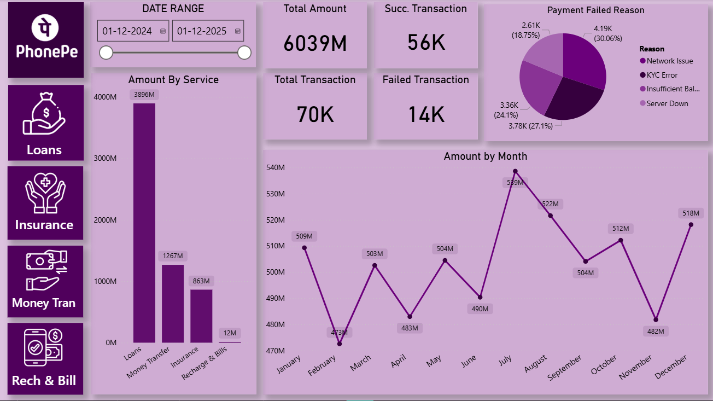
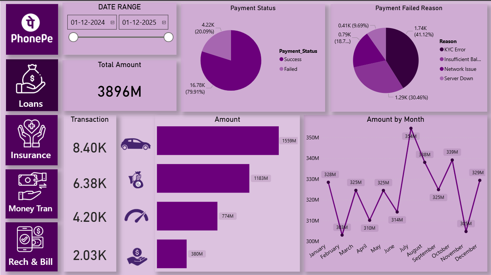
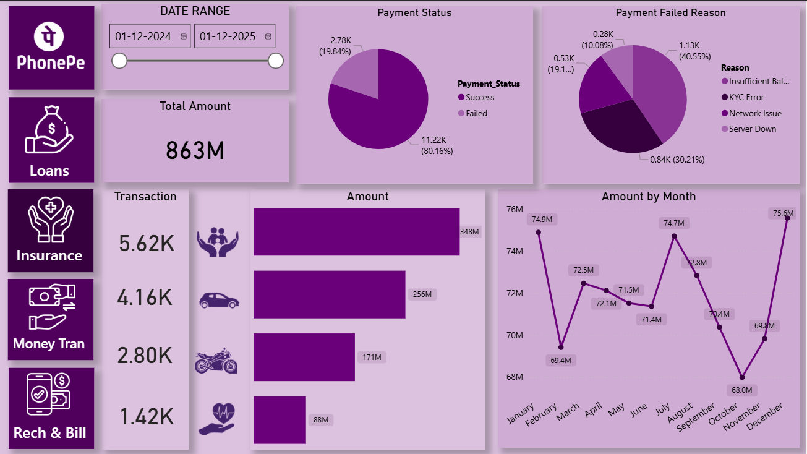

# 📱PhonePe UPI & Services Performance Dashboard (Power BI + Excel)


<p align="center">
  
</p>


A full-scale fintech analytics dashboard built using real-world transaction patterns inspired by PhonePe.  
This project analyzes one year of digital payments (Dec-2024 to Dec-2025), covering service performance, payment status, failure reasons, and monthly seasonal trends.

---

## 🧩 Overview

| Section | Description |
|--------|-------------|
| Purpose | Analyze fintech transaction behaviour across Loans, Money Transfer, Insurance, and Recharge & Bills |
| Tools Used | Power BI, Excel, DAX |
| Focus Areas | KPIs, Service Revenue, Monthly Trends, Failure Reasons, Success vs Failed Analytics |
| Outcome | Actionable insights for digital payment optimisation |

---

## ❗ Problem Statement

| Problem | Why It Matters |
|---------|----------------|
| High transaction volume but unclear revenue drivers | Fintechs must know which services generate the most value |
| Payment failures affecting user experience | Failure reasons must be diagnosed to improve reliability |
| Hard to detect seasonal patterns | Monthly trends help with strategic planning |
| Lack of holistic view | A unified dashboard solves fragmented insights |

---

## 📅 Dataset Details

| Feature | Value |
|---------|--------|
| Date Range | **01-Dec-2024 to 01-Dec-2025** |
| Total Amount | **6039M** |
| Total Transactions | **70K** |
| Successful Transactions | **56K** |
| Failed Transactions | **14K** |
| Success Rate | **~80%** |
| Failure Rate | **~20%** |
| Services Included | Loans, Money Transfer, Insurance, Recharge & Bills |

---

## 🛠 Tools & Technologies

| Tool | Usage |
|------|--------|
| **Excel** | Data cleaning, formatting, preprocessing |
| **Power BI** | Dashboard design, modelling, DAX |
| **DAX Measures** | `SUM()`, `DIVIDE()`, `CALCULATE()`

---

## 🔍 Methods Used

| Step | Description |
|------|-------------|
| Data Cleaning | Removed inconsistencies & formatted date fields |
| KPI Development | Total Amount, Transactions, Success %, Failure % |
| Service-Level Analysis | Loans, Money Transfer, Insurance, Rech & Bill |
| Time-Series Modeling | Monthly trend (Jan–Dec) |
| Failure Diagnostics | Network, KYC, Server Down, Insufficient Balance |
| Dashboard Navigation | Multi-page structure with slicers |

---

## ⭐ Key Insights 

| Insight | Description |
|---------|-------------|
| **1. Loans dominate revenue** | Loans generated **3896M** (~64% of total). Strongest revenue driver. |
| **2. Money Transfer highest in transactions** | **28K+ transactions**, amounting to **1267M** — peak user activity. |
| **3. Recharge & Bills is lowest performing** | Only **12M revenue** — needs campaigns or optimisation. |
| **4. Failure reasons are significant** | Network Issue (30.06%), KYC Error (27.1%), Insufficient Balance (24.1%), Server Down (18.75%). |
| **5. Seasonal variation exists** | Highest: **July (539M)**, Lowest: **February (473M)**. Mid-year surge observed. |
| **6. Strong conversion rate** | ~80% successful payments indicate stable system performance. |

---

## 📊 Service Breakdown

| Service | Amount (M) | Transactions |
|--------|-------------|--------------|
| **Loans** | **3896M** | 8.40K |
| **Money Transfer** | **1267M** | 28K+ |
| **Insurance** | **863M** | 5.62K |
| **Recharge & Bills** | **12M** | 1.42K |

---

## ⚠ Payment Failure Analysis

| Failure Reason | Percentage |
|----------------|------------|
| **Network Issue** | **30.06%** |
| **KYC Error** | **27.1%** |
| **Insufficient Balance** | **24.1%** |
| **Server Down** | **18.75%** |

---

## 📅 Monthly Trend (Amount by Month)

| Month | Amount |
|--------|--------|
| **Highest (July)** | **539M** |
| **Lowest (February)** | **473M** |
| Pattern | Mid-year peak, early-year dip |

---

## 🖼️ Dashboard Preview

<p align="center">
  
</p>

<p align="center">
  
</p>

<p align="center">
  
</p>

<p align="center">
  
</p>

---

## 📄 Dashboard Pages

| Page | Details |
|------|----------|
| **Page 1 – loans** | KPIs, bar chart, Time Range, Failure Reason Pie chart
| **Page 2 – insurance** | KPIs, bar chart, Time Range, Failure Reason Pie chart
| **Page 3 – money transfer** | KPIs, bar chart, Time Range, Failure Reason Pie chart 
| **Page 4 – recharge & bill** | KPIs, bar chart, Time Range, Failure Reason Pie chart

---

## ▶️ How to Run the Project

| Step | Action |
|------|--------|
| 1 | Clone or download this repository |
| 2 | Open `PhonePe_Dashboard.pbix` in Power BI Desktop |
| 3 | Place Excel file inside `/data` folder |
| 4 | Click **Refresh** |
| 5 | Use filters for Date Range & Services |

---

## 📁 Repository Structure

```
fintech-analytics-phonepe-dashboard-powerbi-excel/
│
├── dashboard/
│   └── PhonePe_Dashboard.pbix
│
├── data/
│   └── phonepe_raw_data.xlsx
│
├── images/
│   ├── home_Page.png
│   ├── loans_Page.png
│   ├── insurance_Page.png
│   └── money_transfer_Page.png
│   └── recharge_&_bill_Page.png
└── README.md
```

---

## 🧾 Results & Conclusion

| Result | Summary |
|--------|---------|
| Revenue Insight | Loans are the biggest revenue driver (3896M) |
| User Behaviour | Money transfer is most frequently used |
| Weakest Area | Recharge & Bills has minimal traction |
| System Performance | ~80% success rate — reliable but improvable |
| Business Recommendation | Reduce network/KYC failures, promote low-performing services |

---

## 🚀 Future Enhancements

| Improvement Area | Plan |
|------------------|------|
| Add forecasting | Power BI or Python Prophet |
| Add demographics | Region / Age segmentation |
| Automate refresh | Power BI Gateway |
| Add API data | Live PhonePe-style monitoring |

---

## 👤 Author & Contact

| Field | Info |
|--------|-------|
| **Name** | Sharik Ansari |
| **Email** | sharikkha8900@gmail.com |
| **LinkedIn** | https://www.linkedin.com/in/sharik-ansari-312021389 |
| **GitHub** | https://github.com/sharikansari0 |

⭐ *If you found this project valuable, please give the repository a star!*
 (Power BI + Excel)
